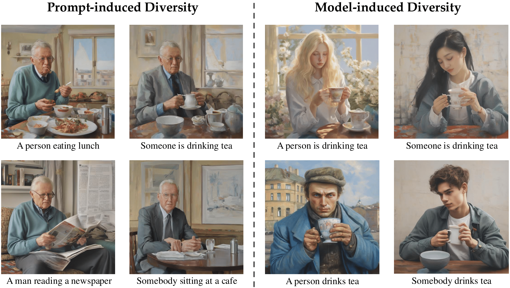

# Conditional Vendi
This Repository contains source code for paper "Conditional Vendi Score: An Information-Theoretic Approach to Diversity Evaluation of Prompt-based Generative Models"

Paper: Conditional Vendi Score: An Information-Theoretic Approach to Diversity Evaluation of Prompt-based Generative Models

Mohammad Jalali, Azim Ospanov, Amin Gohari, Farzan Farnia

1 **Isfahan University of Technology (IUT)**, 2 **The Chinese University of Hong Kong (CUHK)**

* Work done during an internship at CUHK

## 1. Prompt-induced vs. Model-induced Diversity

Illustration of **prompt-induced diversity**, where the diversity of generated images follows the variety of prompts 
and has little variation in other details, vs. **model-induced diversity**, where the diversity of images 
for similar prompts is due to the generation model.
### Abstract

Text-conditioned generation models are commonly evaluated based on the
quality of the generated data and its alignment with the input text prompt. On
the other hand, several applications of prompt-based generative models require
sufficient diversity in the generated data to ensure the models' capability of
generating image and video samples possessing a variety of features. However,
most existing diversity metrics are designed for unconditional generative
models, and thus cannot distinguish the diversity arising from variations in
text prompts and that contributed by the generative model itself. In this work,
our goal is to quantify the prompt-induced and model-induced diversity in
samples generated by prompt-based models. We propose an information-theoretic
approach for internal diversity quantification, where we decompose the
kernel-based entropy $H(X)$ of the generated data $X$ into the sum of the
conditional entropy $H(X|T)$, given text variable $T$, and the mutual
information $I(X; T)$ between the text and data variables. We introduce the
\emph{Conditional-Vendi} score based on $H(X|T)$ to quantify the internal
diversity of the model and the \emph{Information-Vendi} score based on $I(X;
T)$ to measure the statistical relevance between the generated data and text
prompts. We provide theoretical results to statistically interpret these scores
and relate them to the unconditional Vendi score. We conduct several numerical
experiments to show the correlation between the Conditional-Vendi score and the
internal diversity of text-conditioned generative models.